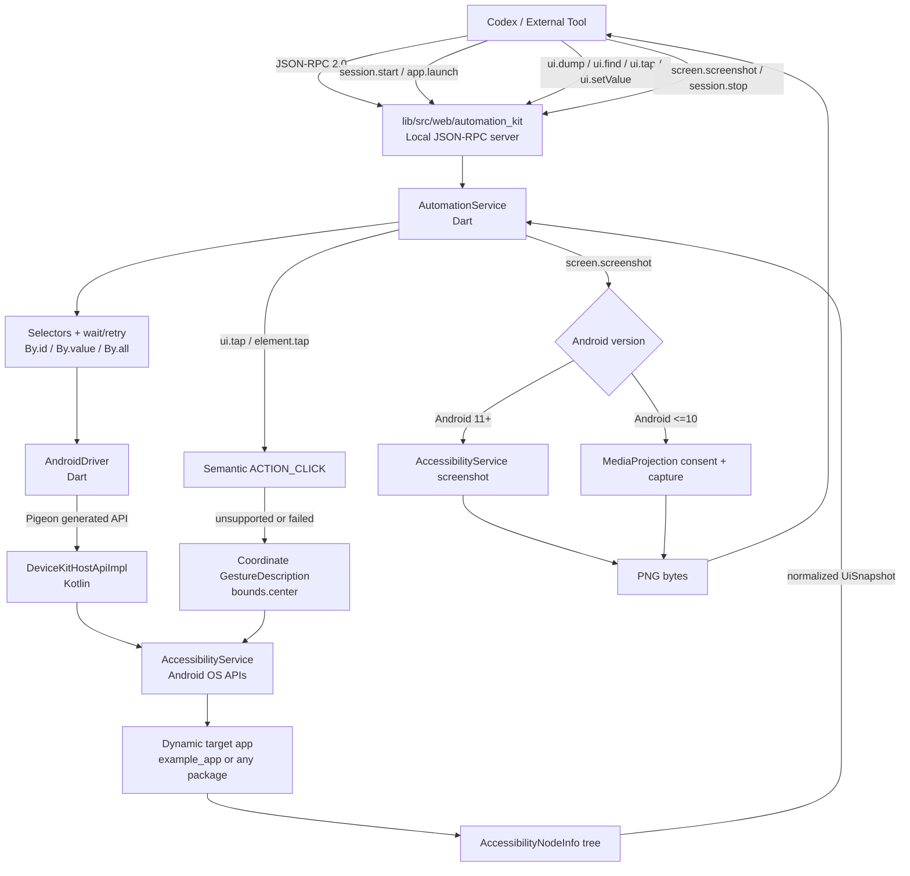

# Cross-platform Automation Kit

This repository contains the `device_kit_lib` Flutter plugin plus the
platform-independent Automation Kit MVP:

```text
lib/src/web/automation_core/  Shared contracts, selectors, and service
lib/src/web/automation_web/   Chrome DevTools Protocol backend
lib/src/web/automation_kit/   Local JSON-RPC CLI/server
bin/device_kit_lib.dart       Root-plugin JSON-RPC entrypoint
example_app/                  Flutter Web counter app with semantics identifiers
```

The Android implementation is a separate controller app and target app:

```text
example/           Device Kit controller app; depends on device_kit_lib
example_app/       Independent target counter app; does not depend on the kit
```

`example` accepts a target Android package name at runtime. The default value
`com.example.example_app` is only a demo target; the native `launchApp` API is
dynamic and does not contain a target package allow-list.

## Device-control flow

```text
                    External tools
                         │
                    JSON-RPC
                         │
              ┌──────────▼──────────┐
              │ Automation Agent    │
              │ Dart Core           │
              │                     │
              │ socket server       │
              │ session             │
              │ selector            │
              │ wait/retry          │
              └──────────┬──────────┘
                         │
                    PlatformDriver
                         │
       ┌────────┬────────┼────────┬────────┬────────┐
       │        │        │        │        │        │
    Android   iOS      macOS    Windows  Linux     Web
       │        │        │        │        │        │
Accessibility XCTest    AX       UIA    AT-SPI   BiDi
                   runner
```



The Android plugin uses Pigeon from `pigeons/messages.dart`. Generated Dart,
Kotlin, Swift, and C++ bindings are kept in their platform output folders.
Selectors and retry/wait logic remain in Dart; Android only exposes
AccessibilityService and OS capabilities.

The root plugin adapts the Pigeon-backed Android/iOS/macOS `DeviceDriver`
through `DeviceKitAutomationBackend`. The three Automation Kit layers now live
under `lib/src/web/`, so the shared `AutomationService` can drive native
devices and the CDP browser with the same selector contract.

## Shared iOS/macOS implementation

The iOS and macOS plugin sources share `darwin/device_kit_lib/` through
`sharedDarwinSource: true`. Pigeon generates one Swift contract at
`darwin/device_kit_lib/Sources/device_kit_lib/Messages.g.swift`; conditional
Swift files select UIKit/XCTest behavior on iOS and the macOS Accessibility
API (`AXUIElement`) on macOS. macOS automation requires the host application
to be trusted under **System Settings > Privacy & Security > Accessibility**.

Build or run the macOS example with Flutter:

```bash
cd example
flutter run -d macos
```

Before calling cross-application AX actions, add the example app (or the
host application that embeds this plugin) to the macOS Accessibility allowlist.
The host process must also be allowed to use macOS Accessibility APIs; the
example controller therefore disables App Sandbox in its macOS entitlements.

## Windows UI Automation implementation

The Windows plugin uses Microsoft UI Automation (UIA) for semantic tree dumps
and element actions, `SendInput` for coordinate/key input, Win32 clipboard
APIs, and Windows Imaging Component (WIC) for PNG desktop screenshots. Every
operation includes the session, operation name, thread, target, process id,
snapshot generation, and native error details in `OutputDebugString` and, when
logging is enabled, in:

```text
%TEMP%\device_kit_lib_windows.log
```

The example controller enables Windows logging automatically. Set
`DEVICE_KIT_LIB_WINDOWS_LOG=1` to force logging for another host. Windows
automation may still be blocked when the controller and target run at
different elevation levels or in different desktop sessions; the log records
the UIA HRESULT and Win32 error needed to diagnose those cases.

## One scenario for all platforms

The shared counter flow is defined once in
`packages/scenarios/ex_scenario_1.yaml`. The Android/iOS/macOS/Windows native
integration test and the Web CDP E2E both consume that file. Override the
Windows executable path on the real machine with
`EXAMPLE_APP_WINDOWS_TARGET`.

Native example run:

```bash
cd example
flutter test integration_test/scenario_test.dart -d windows
```

Web E2E run:

```bash
RUN_WEB_E2E=1 flutter test e2e/example_app_e2e_test.dart
```

## iOS XCTest integration

iOS cross-app input is implemented by XCTest/XCUITest in a separate product
exported by the plugin:

```text
darwin/device_kit_lib/Sources/device_kit_lib/          Flutter/Pigeon runtime
darwin/device_kit_lib/Sources/device_kit_lib_xctest/  XCTest/XCUITest driver
```

The `device-kit-lib-xctest` Swift product is linked only by native UI-test
targets. `example_app/ios/RunnerUITests` imports that product and uses the
driver's raw snapshot and primitive-action API; selector and wait/retry logic
remain in Dart. XCTest is therefore reusable by native app test targets
without being linked into the production Flutter plugin.

## Android permissions

The controller must have its `DeviceKitAccessibilityService` enabled by the
device owner or test environment. This is a special Settings permission, not a
normal runtime permission, so Patrol's `grantPermissionWhenInUse()` cannot grant
it. Patrol can be used in a test harness to tap through the device's Settings
UI, but that flow is Android/OEM/localization-specific and is intentionally not
a runtime dependency of this plugin.

On Android 11 and newer, screenshots use AccessibilityService directly. On
older Android versions, screenshots require the user to approve the
MediaProjection consent dialog through the controller's **Request screenshot
permission** button before calling **Take screenshot**.

## Run the tests

```bash
flutter test
cd example_app && flutter test
```

Build the example app for local browser automation:

```bash
cd example_app
flutter build web --no-web-resources-cdn
```

Run the browser E2E (Chrome/Chromium is required):

```bash
RUN_WEB_E2E=1 flutter test e2e/example_app_e2e_test.dart
```

Run the Android self-test on a connected device (Patrol CLI is required):

```bash
cd example
patrol test --target patrol_test/android_automation_test.dart
```

The Patrol test is test-only setup. It can navigate Android Settings to enable
the Device Kit AccessibilityService and can approve the MediaProjection dialog;
the target-app UI dump, selectors, wait, tap, and screenshot calls still use
the shared `device_kit_lib` Dart API.

Build and run the iOS XCTest target on a booted simulator:

```bash
cd example_app/ios
xcodebuild -project Runner.xcodeproj \
  -scheme Runner \
  -destination 'platform=iOS Simulator,name=<simulator-name>' \
  test
```

Use `xcodebuild -showdestinations` to select an installed simulator. The
XCTest target launches `com.example.exampleApp` itself; it is not a runtime
accessibility service inside the production Flutter process.

The local JSON-RPC app reads line-delimited JSON-RPC 2.0 requests from stdin by
default. Start it with `dart run bin/device_kit_lib.dart --http --port 8787`
for a loopback HTTP server.

Selectors are represented by `By.id`, `By.text`, `By.label`, `By.role`,
`By.value`, and `By.all`. They are matched in Dart against normalized
`UiSnapshot` data; browser-specific DOM/CDP details remain inside
`lib/src/web/automation_web`.
